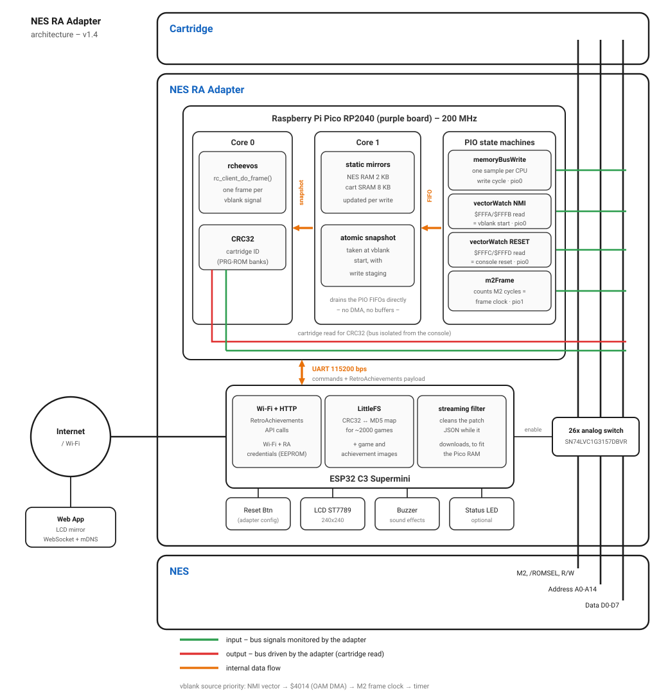

# NES RA Adapter Project
[](https://github.com/odelot/nes-ra-adapter/blob/main/README.pt-br.md)

Repository of the **NES RetroAchievements Adapter** project – a maker initiative with a "cyberpunk western" style that transforms the physical NES console (released in 1985) by adding Internet connectivity and achievement functionality, supported by the amazing RetroAchievements community.

<p align="center">
  <a href="https://youtu.be/u1GWOFgOU88">
    
  </a>
</p>

**Now you don't need to open your console!!!**

<p align="center">  
      
</p>

---

## Table of Contents

- [Disclaimer](#disclaimer)
- [Introduction](#introduction)
- [Getting Started (How to Build)](#getting-started--how-to-build)
- [Architecture and Functionality](#architecture-and-functionality)
- [Limitations](#limitations)
- [General Information](#general-information)
- [Version History](#version-history)
- [Contributions](#contributions)
- [License](#license)
- [FAQ](#faq)
- [Acknowledgments](#acknowledgments)
- [Similar Projects](#similar-projects)

---

## Disclaimer

The project is not responsible for any use or damage it may cause. Build and use it at your own risk. This is a **PROTOTYPE** that works but still needs to evolve into a final version—with revised hardware, extensive testing, and easy replication. We want everyone to be able to build and use this prototype, but only attempt it if you know what you're doing.

---

## Introduction

The **NES RA Adapter** transforms your original NES console into an interactive, Internet-connected machine, allowing real-time achievement unlocking through the RetroAchievements platform. Inspired by the Game Genie with a touch of cyberpunk western, the adapter:
- **Identifies the game** by reading the cartridge (via CRC calculation).
- **Monitors the console's memory** to detect events and achievements.
- **Provides connectivity and interface** through a TFT screen, buzzer, and smartphone configuration.

### Repository Organization

- **nes-pico-firmware**: source code for the firmware used on the Raspberry Pi Pico (Chinese purple board).
- **nes-esp-firmware**: source code for the firmware used on the ESP32 C3 Super Mini.
- **hardware**: schematics and Gerber files for the v1.0 boards (NES 72-pin by GH and Famicom 60-pin by mi213), plus the old v0.1/v0.2 prototype PCBs used during development.
- **3d parts**: STL files for the modeled case, inspired by the Game Genie (NES 72-pin and Famicom 60-pin designs).
- **misc**ellaneous: auxiliary tool and files (LCD mirror Web App / CRC32<->RA Hash map creator / AWS Lambda to shrink RA response / TFT config).

---

## Getting Started / How to Build

### Acquire the Parts

#### Board 1

| Part Name                                                         | Quantity   | 
|-------------------------------------------------------------------|------------|
| NES 72-pin slot*                                                  | 1x         |
| SN74LVC1G3157DBVR                                                 | 26x        |
| Raspberry Pi Pico (purple board)                                  | 1x         |
| Flat cable 20cm 1mm reverse 5pin                                  | 1x         |
| FFC & FPC Connectors 1.0 FFC Non ZIF SMT 5 pin - MOLEX 52808-0570 | 1x         |
| PCB set                                                           | 1x         |
| Electrolytic capacitor 10µF 16V                                   | 3x         |

\* for the Famicom board, use a 60-pin slot instead

#### Board 2 - PTH (Pin Through-Hole)

| Part Name                                                         | Quantity   |
|-------------------------------------------------------------------|------------|
| ESP32 C3 Supermini PLUS (with external antenna)                   | 1x         |
| 1.3 inch LCD 240x240 ST7789 with 7 pins                           | 1x         |
| Passive Buzzer 16 ohms ac/2khz + Transistor BC548                 | 1x         |
| FFC & FPC Connectors 1.0 FFC Non ZIF SMT 5 pin - MOLEX 52808-0570 | 1x         |
| PCB set                                                           | 1x         |
| Electrolytic capacitor 10µF 16V                                   | 1x         |
| 1k ohm resistor (R1)                                              | 1x         |
| 10k ohm resistor (R2)                                             | 1x         |
| Push Button Switch 6x6x6                                          | 1x         |
| 90º degree female header pins (to connect the LCD 7 pins)         | 1x         |
| 100 ohm resistor (R3 and R4) - optional                           | 2x         |
| Bi-color LED (Green / Red, Common Cathode) - optional             | 1x         |

#### Board 2 - SMD (Surface Mount Device)

This is the alternative board 2 designed by mi213. It is the one required by his 3D case designs. See the BOM with the SMD components [here](<hardware/Famicom - v1.0 - by mi213/BOM-board2-famicom-v1.0 - by mi213.csv>) (the same board 2 is used by the NES and the Famicom versions).

#### 3d parts 

| Part Name                                                         | Quantity   |
|-------------------------------------------------------------------|------------|
| 3d printed parts                                                  | 1x         |
| M2 screw 6mm flat head with nut                                   | 10x        |
| M2 screw 10mm cylinder head                                       | 4x         |
| M2 length 3 mm (3.2 mm OD) heat-set inserts (for mi213 design)    | 4x         |

The STL files are in [3d-parts/STL/](3d-parts/STL/), organized by console and designer:
  - [NES - 72pin / 20250911 - odelot design](<3d-parts/STL/NES - 72pin/20250911 - odelot design>) → front-loader and top-loader cases for the through-hole board 2
  - [NES - 72pin / 20260811 - mi213 design](<3d-parts/STL/NES - 72pin/20260811 - mi213 design>) → front-loader and top-loader cases, require mi213's SMD board 2
  - [Famicom - 60pin / 20260811 - mi213 design](<3d-parts/STL/Famicom - 60pin/20260811 - mi213 design>) → Famicom case, requires mi213's SMD board 2

The heat-set inserts are only needed for the mi213 designs.

### Assemble the Circuit

Starting from version 1.0, thanks to GH’s custom boards, you no longer need to open your console to use the adapter. Combined with the 3D-printed case I designed, the adapter works just like a GameGenie,  simply plug it into the cartridge slot and you’re ready to go. A dedicated case for the top-loader model is also available.

Since 2026-08 there is also a **Famicom (60-pin) version of the boards and improved case designs, made by mi213** thanks! ❤️ The hardware files are organized like this:
  - [hardware/NES v1.0 - by GH/](<hardware/NES v1.0 - by GH>) → Gerbers for the NES 72-pin boards 1 and 2
  - [hardware/Famicom - v1.0 - by mi213/](<hardware/Famicom - v1.0 - by mi213>) → Gerbers for the Famicom 60-pin boards 1 and 2, plus the SMD BOM for board 2
  - [hardware/schematics/](hardware/schematics/) → schematics for board 1 and board 2

**Assembly Video Guide (with timecode)** - [https://www.youtube.com/watch?v=4uHbj2ckqv0](https://www.youtube.com/watch?v=4uHbj2ckqv0)
<br/>&nbsp;&nbsp;&nbsp;&nbsp; **\\-** Be sure to watch how the Pico needs to be soldered to avoid issues with the 3D-printed case.
<br/>&nbsp;&nbsp;&nbsp;&nbsp; **\\-** I printed my case using PLA, with three walls and infill ranging from 30% to 100%. You’ll need to use supports for the Board 2 case.

The adapter is built from two PCBs connected by a flat cable:

  - **Main board**: houses 26 SMD analog switches (the most challenging part of soldering), a purple Raspberry Pi Pico RP2040, the cartridge slot, flat cable connector, and a few coupling capacitors.
  - **Secondary board**: includes an ESP32 C3 Supermini, ST7789 LCD display, flat cable connector, buzzer, transistor, coupling capacitor, 10k and 1k resistors, plus an optional bi-color LED (green/red) with two 100 ohm resistors, which can also be used as an alternative to the LCD.

**About PCB Thickness** - NES cartridge PCBs have a board thickness of 1.2mm, while the GameGenie has 1.6mm. After some tests, here is the deal:
  - **NES Front Loader**: order the PCB with a thickness of 1.6mm like GameGenie
  - **NES/Famicom Top Loader**: order the PCB with a thickness of 1.2mm like a original NES Cartridge    

You’ll find everything you need to build it yourself:
  - /hardware → schematic and Gerber files for PCB production (NES and Famicom)
  - /3d-parts → STL files for the front-loader, top-loader and Famicom cases

### Update the Pico and ESP32 Firmware

1. Download the firmwares from the *Releases* section.
   
2. **Raspberry Pi Pico** - Connect the Pico to the computer via USB while holding the BOOTSEL button. A folder will open on your desktop. Copy the `nes-pico-firmware.uf2` file to this folder. This [guide](https://www.youtube.com/watch?v=os4mv_8jWfU) can help you understand the process.
   
3. **ESP32 C3 Supermini** – You'll need to install esptool. Here’s a [guide](https://docs.espressif.com/projects/esptool/en/latest/esp32/installation.html#installation). If you're using the Arduino IDE with ESP32, you already have it installed.
   - First, identify the COM port assigned to the ESP32 when connected via USB (in this example, it's COM11).
   - Open the command line, navigate to the nes-esp-firmware folder inside the release files, and run the following commands (change the COM port accordingly). On Linux/macOS use `esptool.py` (or `python -m esptool`) and a port like `/dev/ttyUSB0`:

```
esptool.exe --chip esp32c3 --port "COM11" --baud 921600  --before default_reset --after hard_reset write_flash  -z --flash_mode keep --flash_freq keep --flash_size keep 0x0 "nes-esp-firmware.ino.bootloader.bin" 0x8000 "nes-esp-firmware.ino.partitions.bin" 0xe000 "boot_app0.bin" 0x10000 "nes-esp-firmware.ino.bin" 

esptool.exe --chip esp32c3 --port COM11 --baud 921600 --before default_reset --after hard_reset write_flash -z --flash_mode dio --flash_freq 80m --flash_size detect 0x210000 ra_rash_map.bin
```

The second command writes the CRC32↔RA-hash map (`ra_rash_map.bin`) into the LittleFS partition at offset `0x210000`

## Architecture and Functionality

The adapter uses two microcontrollers working together:

<p align="center">
  
</p>

### Raspberry Pi Pico

- **Game Identification:** Reads part of the cartridge to calculate the CRC and identify the game.
- **Memory Monitoring:** Uses two cores to monitor the bus and process writes using the rcheevos library:
  - **Core 0:** Calculates the CRC, runs rcheevos routines, and manages serial communication with the ESP32.
  - **Core 1:** Uses four PIO state machines (no DMA): one captures exactly one bus snapshot per CPU write cycle and keeps static mirrors of the NES RAM and cartridge SRAM up to date; one watches the CPU fetching the NMI vector ($FFFA/$FFFB) to mark the exact start of vblank; one watches the RESET vector ($FFFC/$FFFD) to detect console resets; and one runs a frame timer that, together with writes to $4014 (OAM DMA), acts as a fallback for games that run with NMI disabled. At each vblank, core 1 takes an atomic snapshot of the memory mirrors and signals core 0 to run a rcheevos frame.
- **Note:** During game load the Pico reserves ~100KB of RAM for the achievement list response; the buffer is shrunk once the game starts.

### ESP32

- **Connectivity and Interface:** Provides Internet to the NES and manages a TFT screen to display achievements, along with a buzzer for sound effects.
- **Configuration Management:** Stores Wi-Fi and RetroAchievements credentials in EEPROM; configuration is done via smartphone connected to the ESP32 access point.
- **File System and Communication:** Uses LittleFS to store a hash table (CRC32 to MD5) for cartridge identification and game images.
- **Streams LCD content to a Web App** - Uses WebSocket and mDNS to serve a web app that mirrors the LCD display and shows additional achievement events that don’t fit on the physical screen. (More details available in the `misc` folder.) The web app becomes available as soon as the game image appears on the LCD and can be accessed at `http://nes-ra-adapter.local`, make sure your smartphone is connected to the same Wi-Fi network.

---

## Limitations

- **Server Response Size:** During game load the Pico reserves ~100KB of RAM for the RetroAchievements response. The ESP32 cleans the response while it is still being downloaded, so raw payloads bigger than that are supported (FF3, for example, goes from 129KB raw to ~83KB clean). Before sending the set to the Pico, the ESP32 also estimates the peak heap the Pico will need to load it; when the estimate goes over the budget (~168KB), it drops the rich presence first and then the most expensive achievements (achievements flagged as *progression* or *win_condition* are always kept) so the game can still be beaten. The source code of an AWS Lambda function is also available (misc folder) if you prefer to shrink the response server-side.

- **Rare Limitation: Some Games May Be Unmasterable** A single achievement with an extremely large definition can exceed the Raspberry Pi Pico's RAM when expanded by the rcheevos library (one Final Fantasy achievement alone expands to ~140KB of runtime structures, more than the RP2040 can hold together with everything else). So far this affects FF1 and FF3 (in FF3, 8 achievements have to be dropped for the set to fit, so the game can be beaten but not mastered). A future hardware revision based on the RP2350 (520KB of RAM) will remove this limit.

- **Leaderboards are disabled** To shrink data between ESP32 and Pico, the leaderboard feature is disabled. Now that frame detection is precise (v1.4), enabling leaderboards is on the roadmap.

---

## General Information

- **Power Consumption:** The adapter typically consumes 0.105A (max ~0.220A). The LCD screen consumes about 0.035A. Consumption is within the limit of the 7805 voltage regulator present in the NES

- **Logic Level Conversion (5V vs 3.3V):** The prototypes do not use logic level conversion to avoid signal delays. The bus between the cartridge and the NES is disabled when identifying the cartridge (not affecting the NES), and current levels are within Pico’s limits. In the final version, current limiting will be considered to reduce stress on the Pico. If someone in the community identifies the need for level shifting and develops a test scheme without compromising signals, contributions are welcome.

---

## Version History

- **Version 1.4 (2026-08-30)**
  - Complete rewrite of the bus monitoring engine on the Pico: the PIO now captures exactly one sample per CPU write cycle (replacing ~10x oversampling and the stable-value heuristic), DMA and its ping-pong buffers were removed (~16KB of RAM freed), and core 1 drains the PIO FIFOs directly with much lower latency.
  - Precise vblank detection: a dedicated PIO state machine watches the CPU fetching the NMI vector ($FFFA/$FFFB), marking the exact start of vblank, validated on real hardware at 60.099Hz with ±5µs jitter. Games that never do OAM DMA (e.g. Mike Tyson's Punch-Out!!) are now frame-accurate instead of relying on simulated frames. Writes to $4014 and a timer remain as fallbacks for games running with NMI disabled.
  - Console RESET detection via the RESET vector ($FFFC/$FFFD): pressing the console reset button now resets the rcheevos runtime state (hit counts, indicators), the same way emulators do, no more power cycling.
  - Truly atomic RAM snapshots: memory snapshots are taken at vblank start with write staging, guaranteeing point-in-time consistency for achievement evaluation.
  - Fixes for known bugs (credentials management)
- **Version 1.3 (2026-05-15)**
  - Major RAM usage optimization on the Pico: the circular memory buffer was replaced by static mirrors of the NES RAM and cartridge SRAM with atomic snapshots taken during OAM DMA.
  - The serial buffer is now allocated dynamically: ~100KB during the achievement list download (up from 32KB), shrunk after the game loads, supporting much larger achievement sets.
  - Includes the fixes released in the 1.2-alpha build.
- **Version 1.2-alpha (2026-05-04)** - New frame detection heuristic and a fix for the cartridge reading problem affecting Castlevania.
- **Version 1.1 (2026-02-01)** 
  - Major RAM usage optimization on the ESP32 (over 40% savings), increasing the maximum payload size and allowing support for more games, including Super Mario Bros. 3, which became unsupported in version 1.0 after receiving additional achievements at the end of 2025.
  - Added a progress indicator in the upper-left corner of the screen (earned achievements / total achievements) and a Wi-Fi signal strength indicator in the upper-right corner.
  - Implemented a celebration routine when a game is mastered.
  - Fixed minor bugs. The console no longer needs to be powered off and on again after configuring the adapter.
- **Version 1.0 (2025-09-11)** - New miniaturized board and 3d case available - no need to open up the console. Minor changes in the frame detection heuristic. Optional Bicolor Status LED as an option to the LCD. Option to flip the LCD content (needed for the 1.0 case assembly)
- **Version 0.7 (2025-07-09)** - Changes to the frame detection heuristic, using microseconds instead of milliseconds and doing frame skipping if necessary to stay as close as possible to the 60hz cadence (or 50hz, when handling a DEFINE during compilation).
- **Version 0.6 (2025-06-25)** - Bug fix in serial comm on ESP32, "show password" feature for RA credentials during setup, filtering of some achievements directly in the RA API.
- **Version 0.5 (2025-06-24)** - Hardcore mode enabled. LED status in a semaphore way (green, yellow, red) to make the LCD optional. Minor bug fixes.
- **Version 0.4 (2025-05-15)** - Make the experimental mirror screen feature more stable on pico firmware. Releases an Android App (APK - release section) to help on the usage of the mirror screen feature.
- **Version 0.3 (2025-04-24)** – Improve error handling, optimize ram usage, deployed an experimental feature to stream the content of the tiny LCD to a smartphone
- **Version 0.2 (2025-04-07)** – Optimizations to reduce energy consumption.
- **Version 0.1 (2025-03-28)** – Initial prototype version.

---

## Contributions

Everyone is welcome to contribute!
- Submit improvements and pull requests via GitHub.
- Join our Discord channel: [https://discord.gg/baM7y3xbsA](https://discord.gg/baM7y3xbsA)
- Support us by [buying a coffee](https://buymeacoffee.com/nes.ra.adapter) or [Patreon](https://www.patreon.com/RetroAchievementsHardwareLab) .

---

## License

- This project source code is distributed under the **GPLv3** license.
- The PCB circuits are distributed under **CC-BY-4.0** license.
- The 3d parts are distributed under **CC-BY-NC-4.0** license.

---

## FAQ

- **Q: Are you planning to sell the adapter?**
- **A**: No. This is a fully open-source, community-driven DIY project.
<br/>

- **Q: So how can I get one?**
- **A**: It's a DIY project, you can build it yourself!
If you're not comfortable doing that, don’t worry: as seen with other open-source projects like the [GBSControl](https://github.com/ramapcsx2/gbs-control), [GB Interceptor](https://github.com/Staacks/gbinterceptor) and [Open Source Cartridge Reader](https://github.com/sanni/cartreader), the community often steps in to produce and sell units for those who don’t want to build their own. Also, the guy that mods your console is very capable of building one for you.
<br/>

- **Q: Do I need to modify my NES in any way?**
- **A**: No. The adapter is plug-and-play and doesn’t require any console modification.
<br/>

- **Q: Do I need to connect it to a computer?**
- **A**: No! It’s fully self-contained with built-in Wi-Fi.
If you ever need to configure it, you can do so from your smartphone. All achievement processing is handled onboard.
<br/>

- **Q: Will the adapter work with EverDrives?**
- **A**: No. The adapter needs to read the cartridge to identify the game, but when using an EverDrive, it reads the EverDrive’s firmware instead of the game itself. That’s one of the reasons why supporting EverDrives is not currently possible.
<br/>

- **Q: Will it work with Japanese Famicom systems?**
- **A**: Yes, mi213 designed a Famicom (60-pin) version of the boards and a matching 3D-printed case (see the `hardware` and `3d-parts` folders). The NES version also works with 72-to-60 pin adapters: many Japanese games are already mapped on RetroAchievements, and we’ve successfully tested some using a 60-to-72 adapter.
<br/>

- **Q: Will it work with the Disk System?**
- **A**: We haven’t tested with the Disk System since we don’t have one. It’s a possible future enhancement if we can get the hardware for testing.
<br/>

---

## Acknowledgments

- Thanks to **RetroAchievements** and its community for providing achievements for nearly all games and making the system available to everyone.
- Thanks to **NESDEV** for detailed NES documentation and a welcoming forum.
- Thanks to **GH** for the v1.0 NES boards that made the plug-and-play adapter possible, and to **mi213** for the Famicom v1.0 boards and the improved 3D case designs.
- People that helped us during the donation campaign (April/25) - **THANK-YOU**:
  - Aaron P.
  - Stupid C. G.
  - Elaine B.
  - I F. S.
  - Ken G.
  - Kaffe S.
  - Jonathan
  - Sharon L.
  - Daniel P.
  - Ricardo S. S.
  - Fabio H. A. F.
  - Anuar N.
  - Bryan D. S.
  - Giovanni M. C.
  - Paulo H. A. S.
  - Fernando G. S.
  - Rafael B. M.
  - Thiago G. O.
  - Jerome V. V.
  - Ricardo V. A. M.
  - Tiago T.
  - Leonardo P. K.
  - Fábio S.
  - Anderson A. B.
  - Rubens M. P.
  - Silvio L.
  - Carlos R. S.
  - Ademar S. J.
  - Marcel A. B. C.
  - Peterson F. I.
  - Denis D. F. F.
  - Luis A. S.
  - Ariovaldo P.
  - Theo M. O. C. P.
  - Thiago P. L.
  - André R.

## Similar Projects

- **RA2SNES**: [https://github.com/Factor-64/RA2Snes](https://github.com/Factor-64/RA2Snes) - RA2Snes is a program built using Qt 6.7.3 in C++ and C that bridges the QUsb2Snes webserver & rcheevos client to allow unlocking Achievements on real Super Nintendo Hardware through the SD2Snes USB port.

